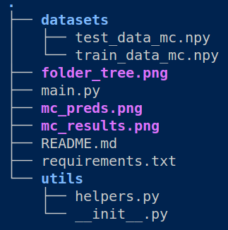
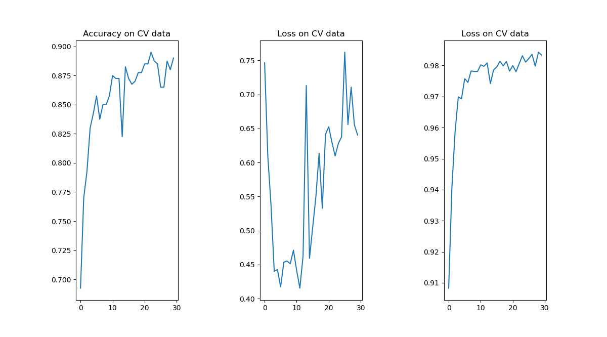
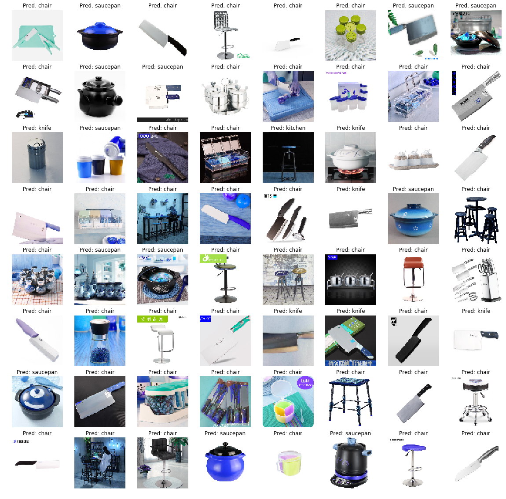

# TensorFlow-Multiclass-Image-Classification-using-CNN-s
This is a multiclass image classification project using Convolutional Neural Networks and PyTorch. If you want to have Tensorflow 1.0 version, take a look at **tensorflow1.0** branch.

It is a ready-to-run code.

## Folder Tree



## Installing Dependencies & Running

```run.sh
python3 -m venv venv
source venv/bin/activate
pip install -r requirements.txt
python main.py
```


## Data
No MNIST or CIFAR-10. 

This is a repository containing datasets of 5200 training images of 4 classes and 1267 testing images.No problematic image.

Just extract files from multiclass_datasets.rar.

train_data_bi.npy is containing 5200 training photos with labels.

test_data_bi.npy is containing 1267 testing photos with labels.

Classes are chair & kitchen & knife & saucepan. Classes are equal(1300 glass - 1300 kitchen - 1300 knife- 1300 saucepan) on training data. 

Download pure data from [here](https://www.kaggle.com/mbkinaci/chair-kitchen-knife-saucepan). Warning 962 MB.

## Architecture

AlexNet is used as architecture. 5 convolution layers and 3 Fully Connected Layers with 0.5 Dropout Ratio. 60 million Parameters.
 


## Results
Accuracy score reached 87% on CV after just 5 epochs.




## Predictions
Predictions for first 64 testing images are below. Titles are  the predictions of our Model.


